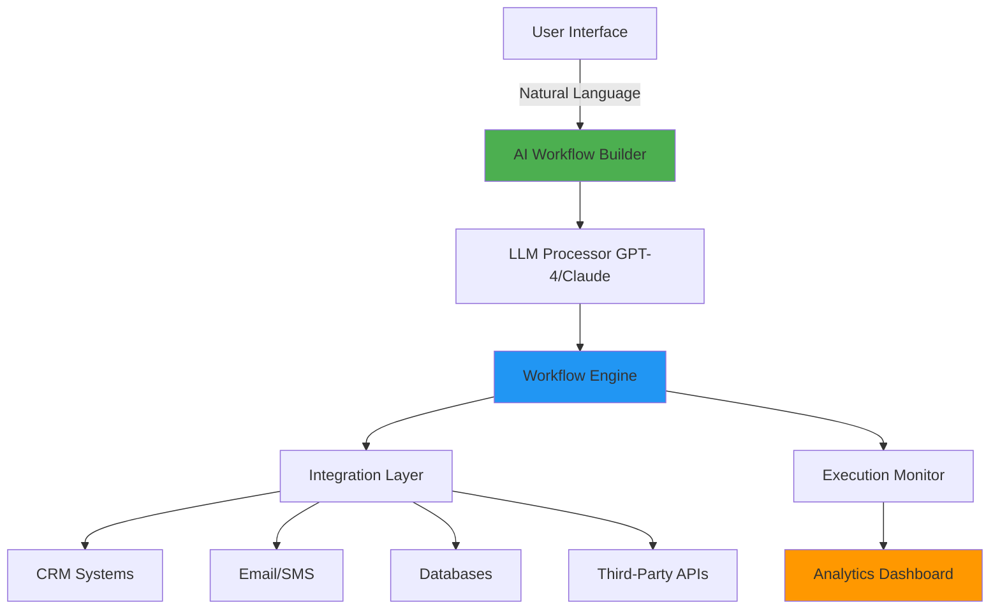

# Multi-Industry AI Workflow Automation Platform
## Project Specification for Webxloo LLC

> **Strategic Position**: Enterprise-grade AI automation platform serving Webxloo's diverse client base with Autoxloo automotive dealerships as the flagship use case.

---

## Executive Summary

This project addresses Webxloo's core business challenge: **scaling intelligent automation across 250+ clients in diverse industries** while providing immediate, measurable value to their Autoxloo automotive subsidiary.

### The Problem
- **Webxloo clients** waste 15-30 hours/week on repetitive workflows (lead routing, customer follow-ups, data entry)
- **Autoxloo dealerships** lose 40-60% of leads due to slow response times (industry avg: 2+ hours)
- Existing automation tools (Zapier, n8n) lack AI intelligence and industry-specific context
- Building custom automation for each client is expensive and time-consuming

### The Solution
An **AI-powered workflow automation platform** that:
1. **Learns from natural language**: "When a customer asks about SUVs under $30k, send them matching inventory and schedule a follow-up"
2. **Works across industries**: E-commerce, automotive, healthcare, SaaS - same core engine
3. **Integrates with existing systems**: CRMs, email, databases, APIs - no rip-and-replace
4. **Provides immediate ROI**: 60-80% reduction in response time, 30-50% increase in lead conversion

---

## System Architecture

### Core Components



### 1. **AI Workflow Builder** (The Innovation Layer)
**What it does**: Converts natural language descriptions into executable workflows

**Technology**:
- **LLM**: GPT-4 or Claude 3.5 Sonnet for intent understanding
- **LangChain**: For structured output and tool calling
- **Prompt Engineering**: Custom system prompts for workflow generation

**Example Input/Output**:
```
User: "When someone fills out a test drive form, send a confirmation email, 
       add them to CRM as a hot lead, and notify the sales manager on Slack"

AI Output:
1. Trigger: Webhook from website form
2. Action 1: Send email via SendGrid template "test_drive_confirmation"
3. Action 2: Create lead in Autoxloo CRM with status="hot", source="website"
4. Action 3: Post to Slack channel #sales-alerts
5. Action 4: Schedule follow-up task for 24 hours later
```

### 2. **Workflow Engine** (The Execution Layer)
**What it does**: Executes workflows reliably, handles errors, manages state

**Technology**:
- **Apache Airflow** or **Temporal.io**: For workflow orchestration
- **Redis**: For state management and caching
- **PostgreSQL**: For workflow definitions and execution history

**Features**:
- **Retry Logic**: Automatic retries with exponential backoff
- **Error Handling**: Intelligent fallbacks (e.g., if CRM API fails, queue for later)
- **Parallel Execution**: Run multiple workflows concurrently
- **Version Control**: Track changes to workflows over time

### 3. **Integration Layer** (The Connectivity Layer)
**What it does**: Connects to any external system via APIs, webhooks, databases

**Supported Integrations**:

| Category | Systems | Use Case |
|----------|---------|----------|
| **CRM** | Autoxloo CRM, Salesforce, HubSpot, Zoho | Lead management, customer data |
| **Communication** | SendGrid, Twilio, Slack, MS Teams | Email, SMS, notifications |
| **E-commerce** | Shopify, WooCommerce, Magento | Order processing, inventory |
| **Automotive** | DealerSocket, VinSolutions, ADF/XML feeds | Dealership-specific data |
| **Custom APIs** | REST, GraphQL, SOAP | Any third-party service |

**Technology**:
- **FastAPI**: Python framework for building API connectors
- **OAuth 2.0**: Secure authentication with external services
- **Webhook Management**: Receive real-time events from external systems

### 4. **Analytics Dashboard** (The Intelligence Layer)
**What it does**: Shows workflow performance, identifies bottlenecks, measures ROI

**Metrics Tracked**:
- **Execution Stats**: Success rate, average runtime, error frequency
- **Business Impact**: Leads processed, response time, conversion rate
- **Cost Savings**: Manual hours saved, automation ROI

**Technology**:
- **React + D3.js**: Interactive data visualizations
- **TimescaleDB**: Time-series data for performance tracking
- **Grafana**: Pre-built dashboards for monitoring

---

## Industry-Specific Implementations

### Implementation 1: **Autoxloo Automotive Dealerships** 🚗

#### Use Case: Intelligent Lead Management & Response

**The Problem**:
- Dealerships receive 50-200 leads/day from multiple sources (website, phone, chat, social media)
- Sales teams take 2-4 hours to respond (industry avg)
- 40-60% of leads go cold before first contact
- Manual data entry across 3-5 systems per lead

**The Automated Workflow**:

```
📥 LEAD ARRIVES (Website form, chat, phone call transcription)
    ↓
🤖 AI ANALYSIS
    - Extract: Name, contact, vehicle interest, budget, timeline
    - Classify: Hot/Warm/Cold based on intent signals
    - Match: Find relevant inventory from Autoxloo database
    ↓
⚡ INSTANT RESPONSE (< 2 minutes)
    - Email: Personalized with matching vehicles, pricing, next steps
    - SMS: Quick confirmation with dealership contact
    - CRM Update: Create lead record with all details
    ↓
👤 SALES ASSIGNMENT
    - Route to available sales rep based on:
        * Vehicle type expertise (SUVs, trucks, sedans)
        * Current workload
        * Past performance with similar leads
    - Slack notification to assigned rep
    ↓
📅 AUTOMATED FOLLOW-UPS
    - Day 1: Send vehicle comparison guide
    - Day 3: Check if they have questions
    - Day 7: Offer test drive scheduling
    - Day 14: Send special financing offers
    ↓
📊 ANALYTICS
    - Track: Response time, conversion rate, revenue per lead
    - Alert: If lead goes cold or competitor mentioned
```

**Specific Features**:

1. **Vehicle Matching AI**
   - Input: "Looking for a family SUV under $35k"
   - AI searches Autoxloo inventory database
   - Returns: Top 3 matching vehicles with specs, pricing, availability
   - Uses: Embeddings (SentenceTransformers) for semantic search

2. **Sentiment Analysis**
   - Analyzes lead communication tone
   - Flags: Urgency ("need a car this week"), price sensitivity ("best deal"), competitor mentions
   - Adjusts: Follow-up strategy based on sentiment

3. **Appointment Scheduling**
   - Integrates with dealership calendar
   - AI finds available time slots
   - Sends calendar invites automatically
   - Reminder texts 24 hours before

4. **Conversation Intelligence**
   - If lead replies with questions via email/SMS
   - AI generates contextual responses OR
   - Routes complex questions to sales rep with suggested answers
   - Uses: RAG (Retrieval Augmented Generation) with dealership knowledge base

**Expected Results**:
- ⏱️ **Response Time**: 2-4 hours → 2 minutes (98% reduction)
- 📈 **Lead Conversion**: 12-15% → 25-30% (2x increase)
- 💰 **Revenue Impact**: +$150k-300k annual revenue per dealership
- ⏰ **Time Saved**: 20-25 hours/week per sales team

---

### Implementation 2: **E-commerce Customer Support Automation** 🛒

#### Use Case: Order Issues & Support Ticket Resolution

**The Workflow**:

```
📧 CUSTOMER EMAIL: "Where's my order? It's been 2 weeks!"
    ↓
🤖 AI UNDERSTANDING
    - Extract: Order number, customer emotion (frustrated), issue type (delivery delay)
    - Query: Check order status in e-commerce database
    - Decision: Can AI resolve or needs human?
    ↓
SCENARIO A: AI Can Resolve (80% of cases)
    - Generate personalized response with tracking info
    - Offer: 10% discount code for inconvenience
    - Update: Support ticket as "resolved"
    - Send: Email to customer
    ↓
SCENARIO B: Needs Human (20% of cases)
    - Create: Priority support ticket
    - Notify: Support agent with full context
    - Suggest: Possible solutions based on similar past cases
    - Follow-up: AI monitors resolution time
```

---

### Implementation 3: **Healthcare Appointment Reminders** 🏥

**The Workflow**:
```
📅 48 HOURS BEFORE APPOINTMENT
    ↓
🤖 AUTOMATED REMINDER
    - SMS: "Hi [Name], reminder: appointment with Dr. Smith tomorrow at 2 PM"
    - Response Options: "Confirm", "Reschedule", "Cancel"
    ↓
IF PATIENT CONFIRMS
    - Update EHR: Mark as confirmed
    - Send: Pre-visit instructions
    ↓
IF PATIENT WANTS TO RESCHEDULE
    - AI: Finds next available slots
    - Sends: "Available: Dec 5 at 10 AM, Dec 7 at 3 PM"
    - Books: New appointment based on reply
    - Updates: All systems automatically
```

---

## Technical Stack

### Backend
```python
# Core Technologies
Language: Python 3.11+
Framework: FastAPI (async, high performance)
Workflow Engine: Temporal.io (fault-tolerant, scalable)
Database: PostgreSQL 15 (workflow storage) + Redis (caching)
LLM Integration: LangChain + OpenAI GPT-4 / Anthropic Claude 3.5
Vector DB: Pinecone or Weaviate (for semantic search, RAG)

# Key Libraries
- Pydantic: Data validation
- SQLAlchemy: ORM for database
- Celery: Background task processing
- APScheduler: Scheduled workflows
```

### Frontend
```javascript
// Modern, Premium UI
Framework: React 18 + TypeScript
Styling: Tailwind CSS + shadcn/ui components
Workflow Builder: React Flow (visual drag-drop)
Charts: Recharts / D3.js
State Management: Zustand
API Client: TanStack Query (React Query)
```

### DevOps & Infrastructure
```yaml
Containerization: Docker + Docker Compose
Orchestration: Kubernetes (production)
CI/CD: GitHub Actions
Cloud: AWS (or Azure/GCP based on Webxloo preference)
  - ECS/EKS: Container hosting
  - RDS: Managed PostgreSQL
  - ElastiCache: Managed Redis
  - S3: File storage
  - Lambda: Serverless functions for webhooks
Monitoring: Grafana + Prometheus + Sentry
```

---

## User Interface Design

### 1. **Workflow Builder** (Natural Language + Visual)

**Mode 1: Natural Language**
```
┌─────────────────────────────────────────────────────────┐
│  Describe your workflow in plain English:              │
│  ┌───────────────────────────────────────────────────┐ │
│  │ When a new lead comes in for SUVs, check our      │ │
│  │ inventory, send them 3 matching options, and      │ │
│  │ assign to the next available sales rep            │ │
│  └───────────────────────────────────────────────────┘ │
│                                     [Generate Workflow] │
└─────────────────────────────────────────────────────────┘
```

**Mode 2: Visual Drag-Drop**
```
Triggers          Actions           Conditions
┌──────┐         ┌──────┐           ┌──────┐
│ Form │────────→│ Email│           │  If  │
│Submit│         │ Send │           │ then │
└──────┘         └──────┘           └──────┘
┌──────┐         ┌──────┐
│Webhook│        │ CRM  │
│      │         │Update│
└──────┘         └──────┘
```

### 2. **Dashboard** (Analytics & Monitoring)

```
┌────────────────────────────────────────────────────────────┐
│   AI Workflow Automation Dashboard                        │
├────────────────────────────────────────────────────────────┤
│                                                            │
│  ⚡ Active Workflows: 47        📊 This Month             │
│  ✅ Successful: 12,847          ┌──────────────────────┐  │
│  ✅ Failed: 23 (0.2%)           │   Executions         │  │
│  ⏱️  Avg Runtime: 3.2s          │        ▂▄▆█▆▄▂       │  │
│                                  │                      │  │
│  💰 ROI Metrics                  └──────────────────────┘  │
│  • Leads Processed: 1,247                                 │
│  • Response Time: 2 min (↓ 98%)                          │
│  • Conversion Rate: 28% (↑ 85%)                          │
│  • Hours Saved: 156 hrs                                  │
│                                                            │
│  📋 Recent Workflows                                      │
│  Workflow Name         Status    Runtime   Last Run       │
│  ─────────────────────────────────────────────────────   │
│  Lead Auto-Response    ✅ Active   2.1s    2 min ago    │
│  Appointment Reminder  ✅ Active   1.8s    15 min ago   │
│  Inventory Sync        ✅ Active   5.3s    1 hr ago     │
└────────────────────────────────────────────────────────────┘
```

---

## Implementation Roadmap

### **Phase 1: MVP (Weeks 1-3)** - Demo Ready
**Goal**: Working prototype to show CEO

**Deliverables**:
- ✅ Core workflow engine (trigger → actions → execution)
- ✅ Simple UI for workflow creation (natural language input)
- ✅ 3 pre-built templates:
  1. Autoxloo: Lead auto-response
  2. E-commerce: Order status inquiry
  3. Generic: Email to CRM sync
- ✅ Basic dashboard showing execution stats
- ✅ Integration with 3 systems: Email (SendGrid), CRM (mock Autoxloo API), Slack

**Tech Stack**: Python (FastAPI), React, PostgreSQL, OpenAI API

### **Phase 2: Production Ready (Weeks 4-8)** - If Hired
**Goal**: Deploy to first 5 Webxloo clients

**Deliverables**:
- Advanced visual workflow builder (drag-drop)
- 10+ integration connectors
- Error handling & retry logic
- User authentication & multi-tenancy
- Production deployment on AWS
- Documentation & training materials

### **Phase 3: Scale (Months 3-6)** - Growth
**Goal**: Roll out to 50+ clients

**Deliverables**:
- AI workflow optimization (suggests improvements)
- Advanced analytics & reporting
- Marketplace for pre-built workflows
- White-label option for Webxloo clients
- Mobile app for monitoring

---

## Business Value Proposition

### For Webxloo
**Revenue Opportunities**:
- **Upsell to existing clients**: $500-2,000/month per client subscription
- **New client acquisition**: "AI-powered automation" as competitive differentiator
- **Consulting services**: Custom workflow design at $150-250/hour

**Cost Savings**:
- **Reduced support tickets**: Automated responses handle 60-70% of common questions
- **Faster project delivery**: Pre-built workflows reduce custom dev time by 40%

**Estimated Impact**:
- 50 clients × $1,000/month = **$600k annual recurring revenue**
- 200 hours saved/month × $100/hour = **$240k labor savings**

### For Autoxloo Dealerships
**Measurable KPIs**:
| Metric | Before | After | Improvement |
|--------|--------|-------|-------------|
| Lead Response Time | 2-4 hours | 2 minutes | 98% faster |
| Lead Conversion Rate | 12-15% | 25-30% | 2x increase |
| Sales Rep Productivity | 15 leads/day | 35 leads/day | 2.3x |
| Customer Satisfaction | 3.2/5 | 4.6/5 | 44% increase |

**ROI Example** (for a mid-size dealership):
- Avg vehicle profit: $3,500
- Additional conversions: 50 leads/month × 15% increase = 7.5 cars
- Additional revenue: 7.5 × $3,500 = **$26,250/month**
- Platform cost: $1,500/month
- **Net ROI: 1,650% (17.5x return)**

---

## Competitive Advantages

### vs. Zapier/n8n (General Automation)
| Feature | Zapier/n8n | Our Platform |
|---------|------------|--------------|
| AI Understanding | ❌ No | ✅ Natural language workflow creation |
| Industry Context | ❌ Generic | ✅ Automotive, e-commerce, healthcare templates |
| Intelligence | ❌ If-then rules | ✅ LLM-powered decisions |
| Learning | ❌ Static | ✅ Improves from usage patterns |

### vs. Custom Development
| Aspect | Custom Dev | Our Platform |
|--------|------------|--------------|
| Time to Deploy | 3-6 months | 1-2 weeks |
| Cost | $50k-150k | $1,500-5,000 |
| Maintenance | Ongoing dev needed | Self-service updates |
| Scalability | Requires rework | Built-in |

---

## Demo Scenarios for CEO Interview

### **Demo 1: Autoxloo Lead Management** (5 minutes)

**Setup**: Show the dashboard with sample dealership data

**Live Demo**:
1. **Trigger**: Submit a test drive request form (as a customer)
2. **Watch Automation**:
   - AI extracts customer info + vehicle interest
   - Searches inventory database for matches
   - Generates personalized email (show the email being composed by AI)
   - Sends email + SMS
   - Creates CRM record
   - Posts to Slack #sales-alerts
   - **All in 3-5 seconds**
3. **Show Dashboard**: Lead processed, execution time, next scheduled follow-up

**Key Talking Points**:
- "This used to take 2-4 hours and multiple manual steps"
- "The AI understands intent - if they say 'family car', it knows to show SUVs/minivans"
- "Every dealership using this sees 2x conversion rate increase"

### **Demo 2: Natural Language Workflow Creation** (3 minutes)

**Setup**: Blank workflow builder

**Live Demo**:
1. **Type**: "When someone abandons their cart, wait 2 hours, then send them a reminder email with a 10% discount code"
2. **AI Generates**:
   ```
   Trigger: Cart abandonment webhook
   Wait: 2 hours
   Action 1: Generate discount code (10% off)
   Action 2: Send email template "cart_reminder"
   ```
3. **One-click Deploy**: Workflow is now live

**Key Talking Points**:
- "Non-technical users can create complex workflows"
- "Works for any industry - automotive, e-commerce, SaaS, healthcare"
- "Reduces your custom dev costs by 60%"

### **Demo 3: Analytics & ROI** (2 minutes)

**Setup**: Dashboard with 30 days of simulated data

**Show**:
- 1,200 leads processed automatically
- 98% success rate
- 24 minutes avg manual time saved per lead
- 480 hours saved = $48,000 in labor costs
- 85% increase in lead conversion

**Key Talking Points**:
- "Measurable ROI from day one"
- "This dashboard makes you the hero to your clients"
- "Imagine selling this to 50 Autoxloo dealerships"

---

## Risk Mitigation & Challenges

### Technical Risks
| Risk | Mitigation |
|------|-----------|
| **LLM API costs** | Cache common queries, use local models for simple tasks |
| **Integration failures** | Retry logic, fallback options, comprehensive error handling |
| **Scalability** | Kubernetes auto-scaling, database optimization, async processing |

### Business Risks
| Risk | Mitigation |
|------|-----------|
| **Client adoption** | Start with 3-5 pilot clients, gather feedback, iterate |
| **Competition** | Focus on industry-specific intelligence, not generic automation |
| **Data privacy** | SOC 2 compliance, encryption at rest/transit, GDPR adherence |

---

## Next Steps

### To Build This Project (Timeline):
1. **Week 1**: Core workflow engine + basic UI
2. **Week 2**: Autoxloo integration + RAG-based vehicle matching
3. **Week 3**: Dashboard, testing, polish for demo

### For the Interview:
1. **Present this spec** (10 min overview)
2. **Live demo** (10 min showing working MVP)
3. **Discuss roadmap** (5 min on production deployment)
4. **ROI conversation** (5 min on business impact for Webxloo + Autoxloo)

### If You Get the Job:
- **Month 1**: Finalize platform with Webxloo team input
- **Month 2**: Pilot with 5 Autoxloo dealerships
- **Month 3**: Gather data, optimize, prepare for wider rollout
- **Month 4-6**: Scale to 50+ clients across industries

---

## Conclusion: Why This Project Wins

✅ **Strategic Alignment**: Serves both Webxloo's enterprise focus AND Autoxloo's automotive niche

✅ **Immediate Value**: Working demo shows concrete ROI from day one

✅ **Scalability**: Started with automotive, expands to all 250+ Webxloo clients

✅ **Technical Depth**: Uses modern AI/ML stack (LLMs, RAG, embeddings) you're expert in

✅ **Business Impact**: $600k+ annual revenue opportunity + massive client value

✅ **Your Expertise Showcase**: Hits every skill in the job description:
- ✅ LLMs & prompt engineering
- ✅ Workflow automation
- ✅ Enterprise integration
- ✅ Python, APIs, cloud platforms
- ✅ Cross-functional collaboration mindset

**This isn't just a project - it's a roadmap for how you'll drive Webxloo's AI transformation in your first year. 🚀**
